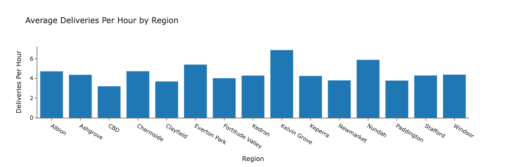
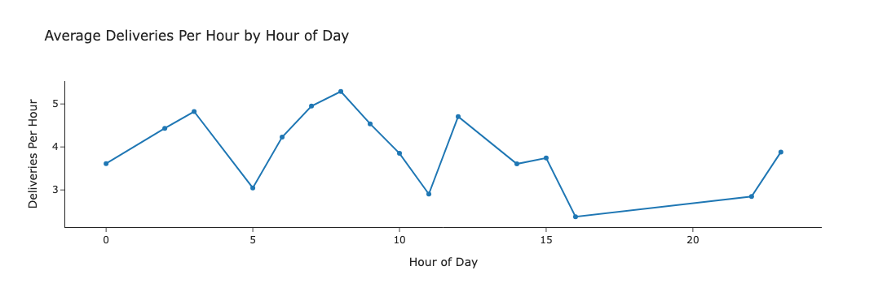
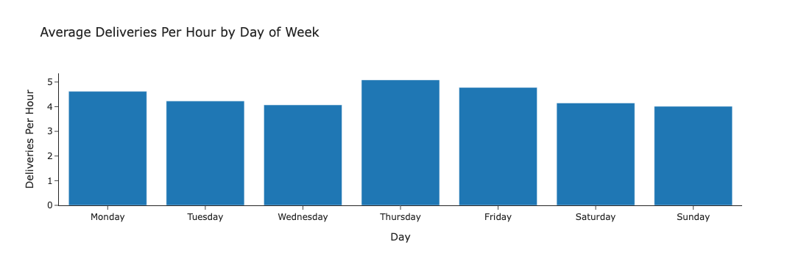
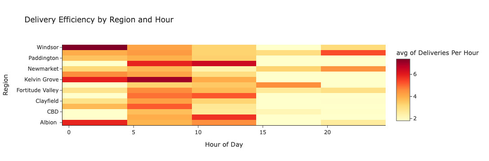

# doordash-delivery-efficiency-analysis
Business analytics project analysing historical DoorDash delivery data to identify efficient regions, peak delivery times, and patterns that improve delivery throughput.

## Tools
Python, Pandas, Plotly, Jupyter Notebook

## What I analysed
- Delivery efficiency based on time gaps between consecutive deliveries  
- Average deliveries per hour by region  
- Delivery efficiency across hours of the day  
- Delivery performance across days of the week  
- Region–hour, region–day, and hour–day combinations to identify strong delivery periods  

## Key insights
- Kelvin Grove, Nundah, and Everton Park showed higher average deliveries per hour than other regions.  
- Delivery efficiency increased during breakfast and lunch periods, reflecting meal demand.  
- Thursday and Friday showed stronger delivery efficiency compared to other days.  
- Certain region and time combinations consistently produced faster delivery cycles.

## Example Visualisations

### Average Deliveries per Hour by Region

### Average Deliveries per Hour by Hour of Day

### Average Deliveries per Hour by Day of Week

### Region and Hour Delivery Efficiency Heatmap

## Outcome
The project identified location and time patterns that can help drivers make better decisions about where and when to dash in order to improve delivery efficiency.
